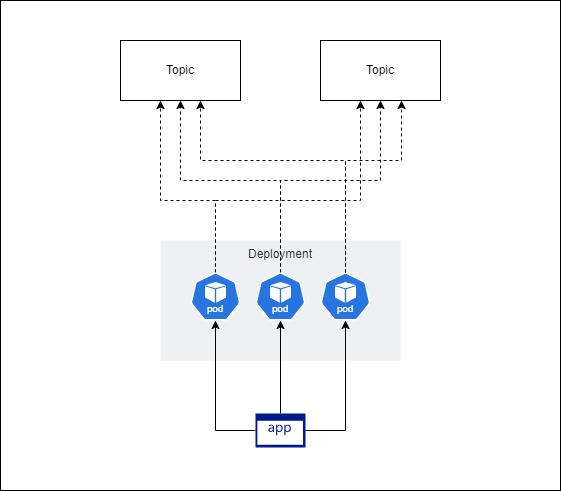
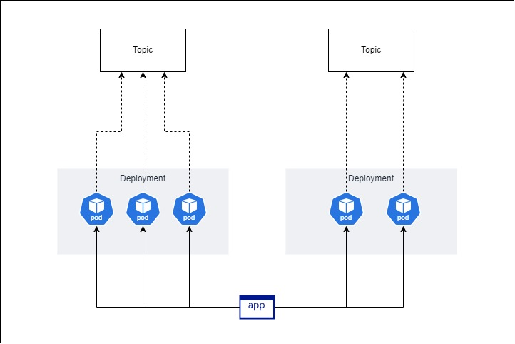

# Workers per Topic

This is a simplified version on one of my projects where one worker application needs to be configured for each Kafka topic. The purpose is so we can scale workers for one topic independently from another topic. And also, it will reduce the amount of load required on the workers having to process multiple topics. All by using a single application. Another requirement is it has to be able to adapt to adding and removing topic dynamically, so no changes when a new topic is introduced or existing topic is removed.

## Stack
- Kubernetes (this example uses Minikube)
- .NET
- CI/CD pipeline (this example)
- jq and yq
- helm

## Diagram

Before the project, we have one application deployed to multiple pods where each pod will subscribe to multiple Kafka topics.

Afterwards, one application will be deployed to multiple pods in multiple deployments where each pod will subscribe only to one Kafka topic.

